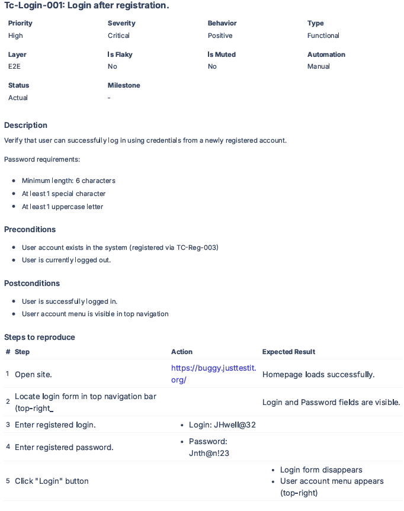

# TC-Login-001: Login after registration

| Field | Value |
|-------|-------|
| **Priority** | High |
| **Severity** | Critical |
| **Behavior** | Positive |
| **Type** | Functional |
| **Layer** | E2E |
| **Automation** | Manual |

## Description
Verify that user can successfully log in using credentials from a newly registered account.

**Password requirements:**
- Minimum length: 6 characters
- At least 1 special character
- At least 1 uppercase letter

## Preconditions
- Network connection available
- User account exists in the system (registered via TC-Reg-003)
- User is currently logged out

## Steps

| # | Action | Expected Result |
|---|--------|-----------------|
| 1 | Open https://buggy.justtestit.org/ | Homepage loads successfully |
| 2 | Locate login form in top navigation bar (top-right) | Login and Password fields are visible |
| 3 | Enter registered login: `JHwell@32` | Field accepts input |
| 4 | Enter registered password: `Jnth@n!23` | Field accepts masked input |
| 5 | Click "Login" button |  Login form disappears  User account menu appears (top-right) |

## Postconditions
- User is successfully logged in
- User account menu is visible in top navigation

