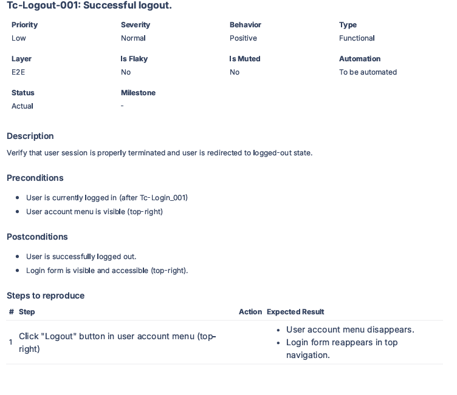

# TC-Logout-001: Successful logout

| Field | Value |
|-------|-------|
| **Priority** | Low |
| **Severity** | Normal |
| **Behavior** | Positive |
| **Type** | Functional |
| **Layer** | E2E |
| **Automation** | Manual |

## Description
Verify that user session is properly terminated and user is redirected to logged-out state.

## Preconditions
- Network connection available
- User is currently logged in (after TC-Login-001)
- User account menu is visible (top-right)

## Steps

| # | Action | Expected Result |
|---|--------|-----------------|
| 1 | Click "Logout" button in user account menu (top-right) | ✅ User account menu disappears ✅ Login form reappears in top navigation |

## Postconditions
- User is successfully logged out
- Login form is visible and accessible (top-right)

