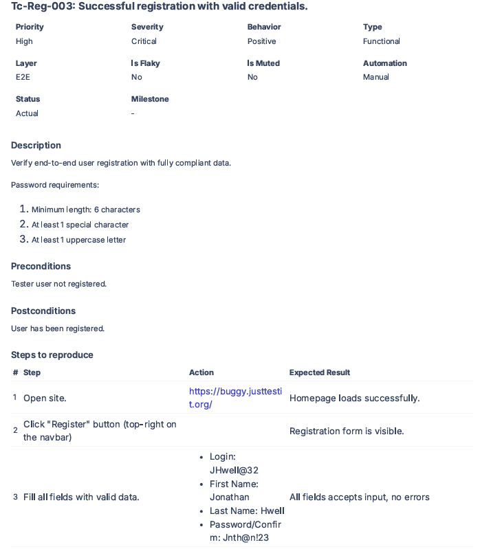
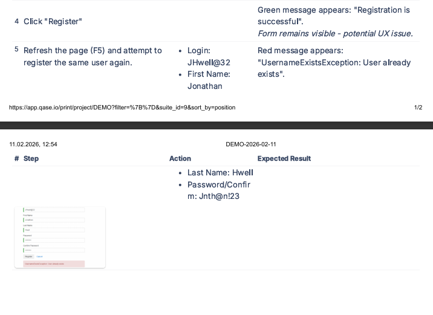

# TC-Reg-003: Successful registration with valid credentials

| Field | Value |
|-------|-------|
| **Priority** | High |
| **Severity** | Critical |
| **Behavior** | Positive |
| **Type** | Functional |
| **Layer** | E2E |
| **Automation** | Manual |

## Description
Verify end-to-end user registration with fully compliant data.

**Password requirements:**
- Minimum length: 6 characters
- At least 1 special character
- At least 1 uppercase letter

## Preconditions
- Network connection available
- Test user not registered in the system

## Steps

| # | Action | Expected Result |
|---|--------|-----------------|
| 1 | Open https://buggy.justtestit.org/ | Homepage loads successfully |
| 2 | Click "Register" button (top-right) | Registration form is visible |
| 3 | Fill all fields with valid data: • Login: `JHwell@32` • First Name: `Jonathan` • Last Name: `Hwell` • Password/Confirm: `Jnth@n!23` | All fields accept input, no errors |
| 4 | Click "Register" button |  Green message: "Registration is successful"  Form remains visible *(potential UX issue)* |
| 5 | Refresh the page (F5) and attempt to register the same user again: • Login: `JHwell@32` • Password/Confirm: `Jnth@n!23` |  Red message: "UsernameExistsException: User already exists" |

## Postconditions
- User account created and active in the system
- Registration form remains visible

