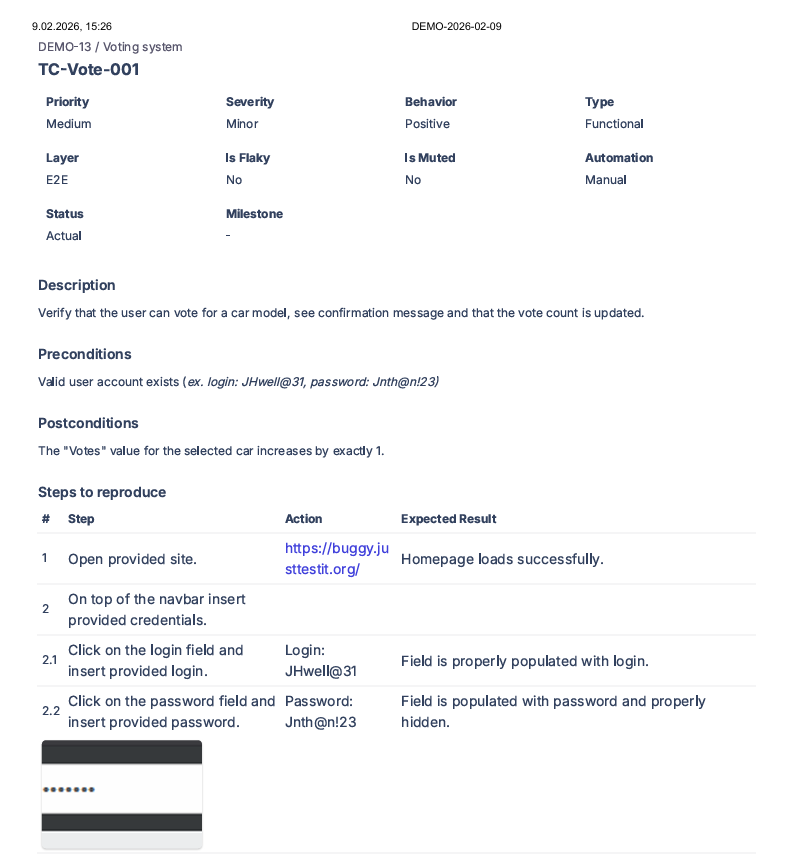
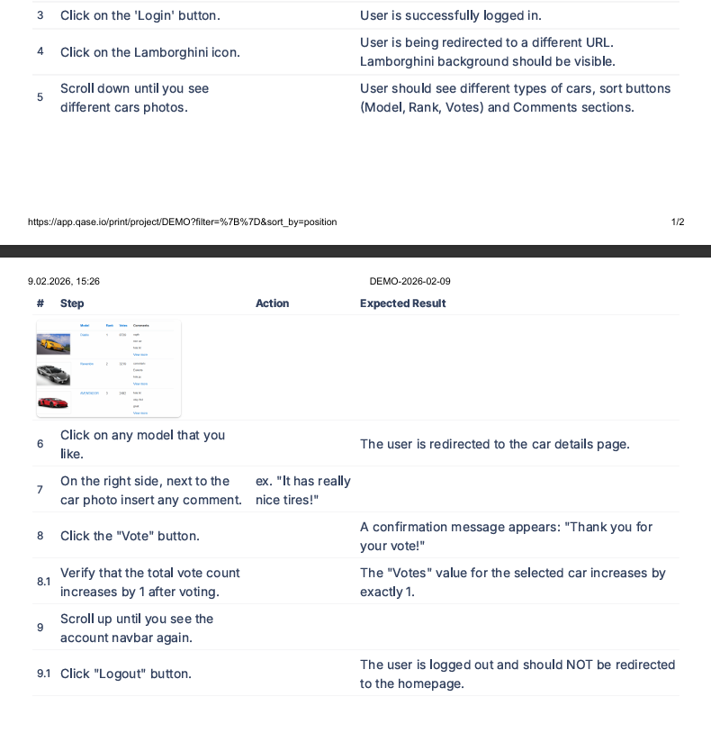

## Metadata
| Attribute | Value |
|-----------|-------|
| **ID** | TC-Vote-001 |
| **Path** | app-testing/test-cases/TC-Vote-001 |
| **Priority** | Medium |
| **Severity** | Minor |
| **Behavior** | Positive |
| **Type** | Functional |
| **Layer** | E2E |
| **Flaky?** | No |
| **Muted?** | No |
| **Automation** | Manual |
| **Status** | Actual |
| **Milestone** | - |

## Description
Verify that the user can vote for a car model, see a confirmation message, and that the vote count is updated correctly.

## Preconditions
- Valid user account exists (ex. login: `JHwell@31`, password: `Jnth@n!23`).

## Postconditions
- Vote is registered for the selected car model.
- User is logged out; login form is visible.

## Test Steps with Detailed Validation

### Step 1: Open site
**Action:** Open https://buggy.justtestit.org/  
**Expected:** Homepage loads successfully.

### Step 2: Log in
#### **Step 2.1: Enter login**
**Action:** Click the login field and enter `JHwell@31`.  
**Expected:** Field is properly populated with the login.

#### **Step 2.2: Enter password**
**Action:** Click the password field and enter `Jnth@n!23`.  
**Expected:** Field is populated and characters are masked.

### Step 3: Submit login
**Action:** Click the "Login" button.  
**Expected:** User is successfully logged in.

### Step 4: Navigate to Lamborghini section
**Action:** Click the Lamborghini icon.  
**Expected:** User is redirected to the Lamborghini page; background matches brand styling.

### Step 5: View car list
**Action:** Scroll down until car models are visible.  
**Expected:** Multiple car models, sort buttons (Model, Rank, Votes), and Comments sections are displayed.

### Step 6: Select a car model
**Action:** Click on any car model.  
**Expected:** User is redirected to the car details page.

### Step 7: Add a comment
**Action:** In the comment field (right side), enter any text (ex. "It has really nice tires!").  
**Expected:** Comment is accepted and displayed in the input field.

### Step 8: Submit vote
**Action:** Click the "Vote" button.  
**Expected:** A green confirmation message appears: *"Thank you for your vote!"*

#### **Step 8.1: Verify vote count update**
**Action:** Observe the "Votes" value for the selected car.  
**Expected:** The vote count increases by exactly **1**.

### Step 9: Log out
#### **Step 9.1: Click Logout**
**Action:** Scroll up and click the "Logout" button in the top navigation bar.  
**Expected:** User is logged out; the login form becomes visible again. **User is NOT redirected to the homepage.**

## Pass/Fail Criteria
- **PASS:** All expected results match actual behavior (vote registered, count incremented, logout successful).
- **FAIL:** Any deviation (e.g., no confirmation message, vote count unchanged, unexpected redirect after logout).

## Obserwacje i notatki
1. **Pełny flow użytkownika:** Logowanie → wybór modelu → komentarz → głosowanie → wylogowanie.
2. **Walidacja danych:** Licznik głosów jest kluczowym wskaźnikiem poprawności działania.
3. **Nieoczekiwane zachowanie po logout:** Brak przekierowania na stronę główną — zgodne z obecnym UX aplikacji.
4. **Gotowy do rozszerzenia:** Można dodać negative case (np. wielokrotne głosowanie).

  

